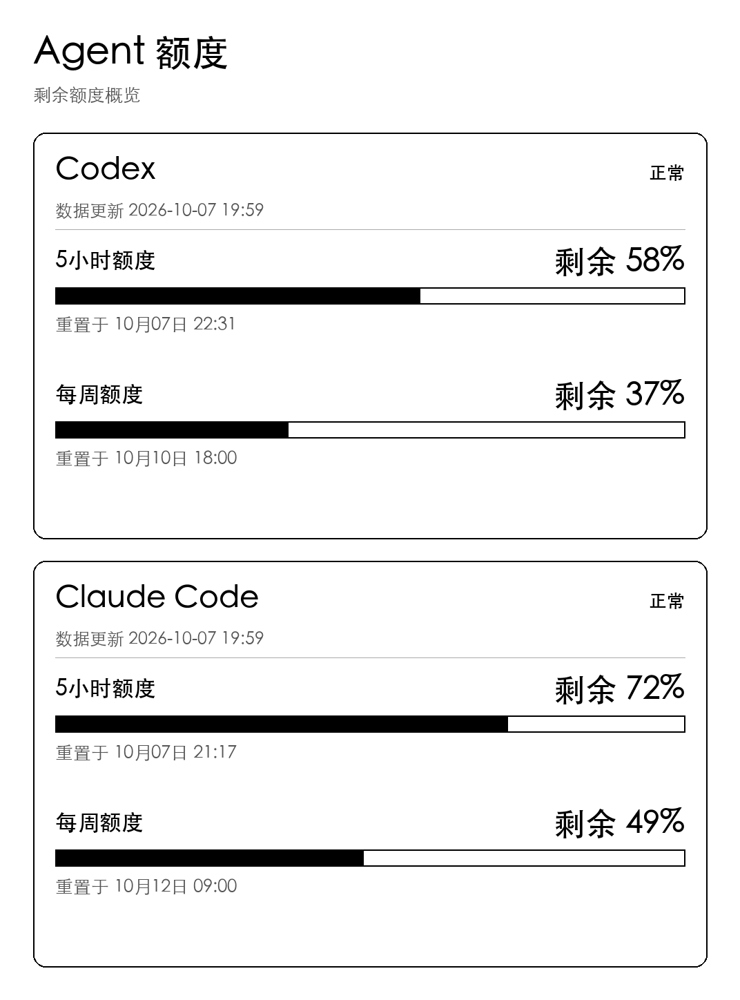

# Kindle Quota Display

把 Kindle Paperwhite 3 变成 Codex / Claude Code 的桌面额度屏。服务器通过 CodexBar CLI 获取额度，生成中文灰度图片；Kindle 定时联网下载，用 FBInk 显示，然后进入 RTC 待机。



上图使用合成数据。界面显示独立额度窗口的剩余比例、固定重置时间、各 Provider 的数据更新时间和异常状态。图片不显示实时钟或冻结的倒计时，适合墨水屏停留展示。

## 前提条件

| 部分 | 必须准备的环境 |
| --- | --- |
| Kindle | 已自行完成 **Jailbreak**，可通过 **Scriptlets** 运行 `documents/*.sh`，已安装支持 PNG 的 **FBInk** |
| 已适配设备 | Paperwhite 3（PW3），竖屏 **1072 × 1448**；其他型号需要修改渲染、PNG 校验及电源适配并重新验收 |
| 采集宿主机 | 已安装 **CodexBar CLI**，并通过它所支持的登录方式取得目标 Provider 的 OAuth 额度访问能力 |
| Python | Python **3.12** 为已测试版本；本地预览/测试需安装 `requirements.txt` 中的 Pillow 和中文字体 |
| 图片服务 | Docker Engine/Desktop 与 Docker Compose；容器只运行本项目的图片/HTTP 服务，不安装 CodexBar、不挂载账户凭据 |
| 网络 | Kindle 与服务器在可互访的局域网；访客 Wi-Fi、AP 隔离、宿主机休眠或 Docker 未运行会影响刷新 |

本项目**不负责 Jailbreak、Hotfix、Scriptlets、FBInk 或账户登录的安装**。请按 [KindleModding](https://kindlemodding.org/) 的设备/固件说明自行准备；Scriptlets 入口规范见[文档](https://kindlemodding.org/kindle-dev/scriptlets.html)，FBInk 见[上游项目](https://github.com/NiLuJe/FBInk)。

CodexBar CLI 的安装方式见[官方 CLI 文档](https://github.com/steipete/CodexBar/blob/main/docs/cli.md)。只安装菜单栏 App 不代表命令已在 PATH 中，请确认 `codexbar --version` 可运行。本项目显式使用 `--source oauth`；CodexBar 的其他数据源和 Provider 并不会自动被本项目支持。

完整部署路径目前以 **macOS + launchd + PW3** 为基线。Linux 可运行 Python/Docker 部分，但定时采集、CodexBar OAuth 和设备部署需要自行适配并验证；Windows 原生采集未适配。

## 能做什么

- Codex 和 Claude Code 各一个当前默认账户，每源最多三个真实额度窗口。
- 独立处理采集失败：保留该源上次成功数据；首次无数据时显示“暂无额度数据”，不需要停用开关。
- 默认每 **180 秒**尝试采集；Kindle 每轮工作后待机 **180 秒**，实际帧间隔还包含联网/下载时间。
- 默认每 **1800 秒**在下一次成功绘图时执行全屏刷新。
- 缓存、配置 IP、主机名及实际私有 `/22` 至 `/30` 子网发现，适应常见 DHCP/换网情况。
- 退出后恢复启动时的 Wi-Fi/屏保状态，下载失败时保留旧画面。

**省电模式会每轮主动关闭无线、唤醒后重新开启**，因此可能看到 Wi-Fi 重连或飞行模式变化，详见[电源与网络行为](docs/power-management.md)。这不是 Wi-Fi 常连模式。

## 快速开始

下载或 clone 本仓库后，在项目根目录执行。以下先准备宿主机与服务，Kindle 写入步骤见后面的手顺。

### 1. 准备 Python 和 CodexBar

```sh
python3 -m venv .venv
. .venv/bin/activate
python -m pip install -r requirements.txt
codexbar --version
```

macOS 本地渲染可使用系统中文字体；Linux 本地测试需安装 `fonts-noto-cjk` 或配置 `QUOTA_FONT` / `QUOTA_FONT_BOLD`。Dockerfile 已安装 Noto CJK，Kindle 无需安装中文字体。

### 2. 执行一次真实采集

```sh
mkdir -p runtime
python -m quota_display.collector --cli "$(command -v codexbar)"
```

标准结果写入 `runtime/quota.json`，终端只显示各源状态。任何源失败时退出码为 1，但仍写入另一源的成功数据或旧缓存；例如 Claude 尚无额度不阻塞 Codex 图片显示。认证问题应在 CodexBar/对应 Provider 的登录环境解决。

不要把原始 CodexBar JSON、token、cookie 或账户配置复制到本项目。`config/providers.json` 是无个人信息的公共默认配置；个人超时配置可放入忽略的 `config/providers.local.json` 并用 `--config` 指定。

### 3. 启动图片服务

```sh
[ -f .env ] || cp .env.example .env
docker compose up -d --build
curl --fail http://127.0.0.1:8486/healthz
```

浏览 [http://127.0.0.1:8486/frame/kindle1.png](http://127.0.0.1:8486/frame/kindle1.png)。默认仅发布到本机；Kindle 使用前，在 `.env` 设置 `QUOTA_BIND_ADDRESS` 为当前 LAN IPv4，或在可信局域网设置为 `0.0.0.0`，再执行 `docker compose up -d`。

该服务**没有 HTTP 认证**，可达设备能读取额度图片、标准额度数据及固定设备诊断状态。`SERVER_ID` 用于发现时核对实例，不是密码；不应直接向公网发布。

### 4. 生成 Kindle 安装包

将示例 IP 和主机名替换为自己的服务器值；下面命令只生成本地文件，不写 USB。

```sh
python scripts/prepare.py kindle \
  --server 192.168.1.50 \
  --host quota-host.local \
  --output build/kindle-install
```

核对包内 `server.conf` 的 FBInk 路径，默认 `/mnt/us/libkh/bin/fbink`。备份、USB 安装、安全推出和首次启动按[安装手顺](docs/runbook.md)执行。点击“开启Agent额度”会真实自检并启用 RTC 省电循环；请先确认设备的 RTC/休眠能力。

点击入口优先显示最近一次成功刷新的 PNG 缓存，遮住 Library，再联网自检并获取新图；没有有效缓存时显示固定的[“正在刷新quota信息”占位图](kindle/assets/bootstrap-frame.png)。已有任务时只恢复画面，不重复启动。缓存位于设备 `/tmp`，正常停止保留，设备重启后可能清除；安装快照不会作为占位图使用。

Kindle 上四个日常入口是 **开启Agent额度 / 刷新 Agent 额度 / 重找额度服务器 / 停止 Agent 额度**。包内另有临时恢复自检入口，详细职责见[脚本说明](docs/kindle-scripts.md)。

### 5. 配置定时采集

macOS 可使用 `scripts/prepare.py launchd` 生成使用绝对 Python/CLI 路径的 plist，默认 `StartInterval=180`。生成、安装、停止和回滚步骤见[手顺](docs/runbook.md)。宿主机睡眠期间不保证采集或 HTTP 可用。

## 开发与 Agent 接手

```sh
sh scripts/offline-check.sh
```

离线检查只使用合成 fixture 和模拟 HTTP/LIPC/RTC/FBInk，不调用 CodexBar，不启动 Docker，不操作 Kindle。预览输出到 `docs/assets/`，测试生成物输出到忽略的 `build/`。

二开请先读 **[DEV.md](DEV.md)**；交给 Agent 时可直接使用其中的 handoff 提示词。仓库级约束见 [AGENTS.md](AGENTS.md)，贡献说明见 [CONTRIBUTING.md](CONTRIBUTING.md)。

## 文档与目录

| 文档 | 内容 |
| --- | --- |
| [技术设计](docs/design.md) | 模块、数据流、失败与恢复边界 |
| [行为 Spec](docs/spec.md) | 数据契约、接口、配置与不变量 |
| [安装手顺](docs/runbook.md) | 采集、Docker、launchd、USB、验证和回滚 |
| [脚本说明](docs/kindle-scripts.md) | 五个入口、四个内部脚本、配置与日志 |
| [验证说明](docs/validation.md) / [验收模板](docs/acceptance-record.md) | 离线与真机验证边界 |
| [发布说明](docs/releasing.md) | 个人文件忽略规则与 GitHub 发布检查 |
| [来源与致谢](docs/references/sources.md) | 外部依赖、版本参考和设计来源 |

```text
quota_display/   标准化、采集、渲染、HTTP 服务
kindle/          POSIX 客户端、配置模板、Scriptlet 入口
config/          无个人信息的采集默认配置
collector/       宿主机采集 shell 入口
scripts/         离线检查、部署包/plist 生成、安装与观察工具
tests/           合成 fixtures 与自动测试
docs/            通用文档、Schema、合成预览
```

`.env`、`runtime/`、`build/` 和 `docs/local/` 为忽略的本地状态，包含个人配置、真实额度、日志、设备备份或安装包，不属于公开源码。

## 许可

[Apache License 2.0](LICENSE)。依赖和参考项目保留各自许可。本项目自行构建 Docker 镜像，`remote-eink-dashboard` 仅为设计参考，没有将其服务或预构建镜像作为运行依赖。
