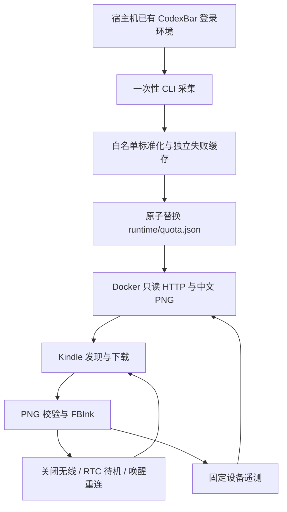

# 技术设计

## 数据流

CodexBar 在宿主机执行并管理自身认证。项目只解析额度结果，不读取 Auth/Keychain/cookie，不保留原始 stdout 或上游任意错误文本。容器没有账户凭据，Kindle 只下载图片并上报固定数值/枚举。

## 模块与职责

| 模块 | 输入 | 输出 |
| --- | --- | --- |
| model | 单 Provider OAuth CLI payload | 重建的白名单数据、固定错误 |
| collector | 配置、CodexBar、旧 snapshot | 有锁保护的原子 JSON |
| renderer | 标准 snapshot、当前时间、字体 | 1072×1448 L8 / 16 灰阶 PNG |
| server | 只读数据目录、有限遥测 | 固定 HTTP 路由、分钟图片缓存、最多128条内存事件 |
| Kindle common/find | 严格配置、实际 CIDR | 服务器地址、下载与状态恢复 |
| Kindle bootstrap/dashboard | Scriptlet 操作、图片、RTC | 单实例循环、绘图、退出清理 |
| prepare/install/observe | 明确参数与部署目标 | 本地安装包/plist、受控 USB 复制、观察证据 |

完整文件地图见 [DEV.md](../DEV.md)，用户入口见[脚本说明](kindle-scripts.md)。

## 数据与失败

每源区分 attempted_at（尝试）、last_success_at（本项目成功处理）、sampled_at（上游数据时间）。单源失败保留该源成功数据及时间，另一源继续更新；首次失败显示暂无数据。顶层更新时间不能把旧缓存变成新额度。

CLI 输出上限1MiB，每源默认30秒，超时或退出后清理进程组；stderr不保存。采集用文件锁避免重叠，临时文件fsync后原子替换。HTTP读入再次标准化，禁止从被手工修改的JSON透传未知字段。

## 图片语义

每个 Provider 一张独立卡片，标题为“Agent 额度”，卡片标题下显示完整数据时间。每个真实窗口有剩余比例、进度条和固定重置日期时刻；不存在的窗口不造100%，未知时间不猜测。

不显示当前钟表、冻结倒计时或相对年龄。服务在线时根据sampled_at判断数据过期，分钟缓存保证状态可变化；服务离线时旧图片不会自行更新，只能根据绝对采样时间判断。

## 网络、电源与恢复

发现顺序：缓存 → 配置IP → 主机名 → wlan0实际私有/22至/30。有界并发扫描，核验固定协议标识和SERVER_ID，成功缓存新地址；不猜更大网段。主机名/mDNS和AP互访能力取决于环境。

正常部署的bootstrap自检通过后启用RTC省电循环。刷新后关闭无线，设置180秒alarm并mem休眠，唤醒后开无线等待8秒再继续。普通等待分支不写RTC，但主入口目前会启用省电。详见[电源行为](power-management.md)。

不覆盖其他alarm，停止/早醒清理自身alarm并恢复开始时的无线/屏保状态；不向未核验归属的PID发信号。下载、PNG校验或解码失败不提前清屏、不替换好缓存。

启动同样遵守画面保留规则：bootstrap只执行真实刷新，不预先显示安装快照。历史bootstrap-frame.png是部署时的静态文件，正常刷新只更新设备临时frame.png；前者不能作为“最新缓存”。即使临时缓存因重启丢失，启动也不主动用安装旧图覆盖仍停留的墨水屏画面。

## 部署边界

Compose默认仅绑定loopback。发布到LAN或全接口后，额度/图片/遥测均无HTTP认证；SERVER_ID不是密码。服务不提供文件浏览、额度写入或设备命令执行。遥测是非权威设备自报，重启清空，不能代替肉眼验收。

生成器只写本项目子目录。USB安装器单独要求明确apply，核验Kindle卷和MountPoint，备份并校验项目文件。macOS launchd使用绝对路径与180秒StartInterval；宿主机睡眠时不保证采集或服务持续在线。
