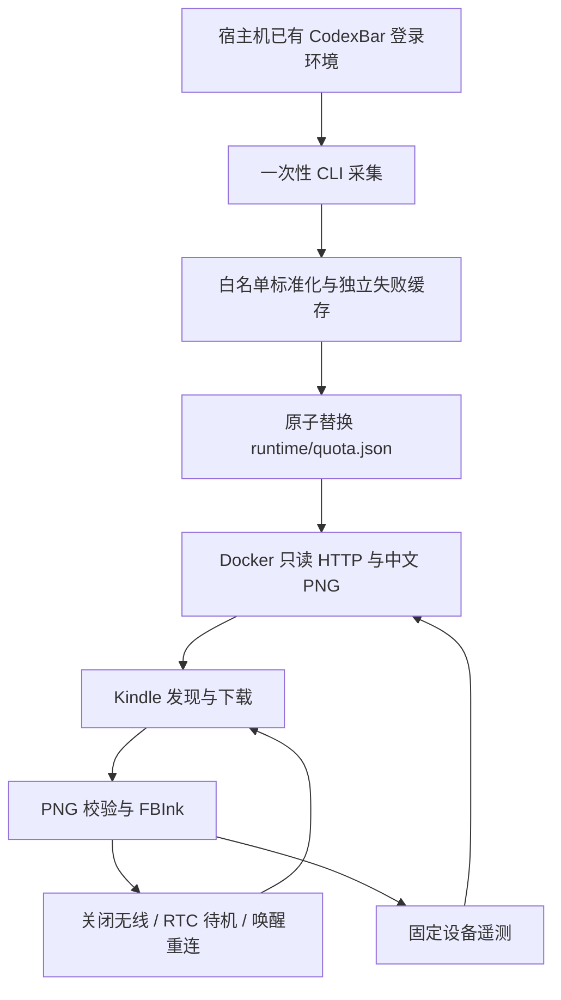

# 技术设计

## 数据流

CodexBar 在宿主机执行并管理自身认证。项目只解析额度结果，不读取 Auth/Keychain/cookie，不保留原始 stdout 或上游任意错误文本。容器没有账户凭据，Kindle 只下载图片并上报固定数值/枚举。

## 模块与职责

| 模块 | 输入 | 输出 |
| --- | --- | --- |
| model | 单 Provider OAuth CLI payload | 重建的白名单数据、固定错误 |
| collector | 配置、CodexBar、旧 snapshot | 有锁保护的原子 JSON |
| renderer | 标准 snapshot、当前时间、字体 | 1072×1448 L8 / 16 灰阶 PNG |
| server | 只读数据目录、有限遥测 | 固定 HTTP 路由、分钟图片缓存、最多128条内存事件 |
| Kindle common/find | 严格配置、实际 CIDR | 服务器地址、下载与状态恢复 |
| Kindle bootstrap/dashboard | Scriptlet 操作、图片、RTC | 单实例循环、绘图、退出清理 |
| prepare/install/observe | 明确参数与部署目标 | 本地安装包/plist、受控 USB 复制、观察证据 |

完整文件地图见 [DEV.md](../DEV.md)，用户入口见[脚本说明](kindle-scripts.md)。

## 数据与失败

每源区分 attempted_at（尝试）、last_success_at（本项目成功处理）、sampled_at（上游数据时间）。单源失败保留该源成功数据及时间，另一源继续更新；首次失败显示暂无数据。顶层更新时间不能把旧缓存变成新额度。

CLI 输出上限1MiB，每源默认30秒，超时或退出后清理进程组；stderr不保存。采集用文件锁避免重叠，临时文件fsync后原子替换。HTTP读入再次标准化，禁止从被手工修改的JSON透传未知字段。

## 图片语义

每个 Provider 一张独立卡片，标题为“Agent 额度”，卡片右上角用黑色粗体显示完整数据时间，状态移到标题下。每个真实窗口有剩余比例、进度条和固定重置日期时刻；不存在的窗口不造100%，未知时间不猜测。

不显示当前钟表、冻结倒计时或相对年龄。服务在线时根据sampled_at判断数据过期，分钟缓存保证状态可变化；服务离线时旧图片不会自行更新，只能根据绝对采样时间判断。

## 网络、电源与恢复

自动发现只走缓存 → 配置IP → 主机名，去重并在原30秒网络预算中最多短试3次。完整扫描仅手动触发，限定实际私有/22至/30、16并发、90秒扫描上限及120秒手动网络总预算。配置ENABLE_SCAN表示允许手动扫描；自动流程不消费该许可。主机名/mDNS和AP互访能力仍取决于环境，无法解析且IP变化时需要手动重找。

后台仅保留一个连续失败计数器：失败加一、封顶5，下一RTC等待为计数×180秒；成功绘图并提交PNG后清零，恢复INTERVAL。网络失败保留图片及原数据时间，正常失败只记一条本地轮次摘要，不重绘缓存或补发离线遥测。无额度fallback有效图片仍是成功。

每轮用/proc/uptime建立共享网络截止时间，无线IPv4就绪、DNS/probe、下载和在线POST消费同一预算。外层watchdog同时限制curl与wget；拥有的命令及扫描子进程在超时/停止时回收。FBInk和设备状态命令另外有短超时；不能把30秒当成整机清醒上限。

RTC函数接受正数delay；每轮关无线并mem休眠。截止时间和经过时间来自所选硬件RTC，不受系统墙钟校正影响。早醒时无线保持关闭，先处理停止/手动请求，再重画缓存和给最多20秒本地交互窗口，然后重设剩余alarm。3次连续立即返回（60秒内每次≤2秒）或挂起/硬件计时失败则保护性退出；普通早醒不退出。只在alarm仍匹配本程序时清除，不覆盖其他任务。

手动rediscover不另起联网actor：有ready worker时发布固定请求ID，核验PID/cmdline后发送USR1，worker在返回/短等待处处理请求，跳过退避并完成扫描和刷新。结果按ID对应，待办重复点击合并，停止优先；无worker时使用独占锁做单次工作。Library操作先唤醒设备，USR1不能从mem唤醒。

固定事件写入lifecycle.log，每轮摘要写入power.log，两者均轮换为上一份并限额；只有本轮health确认可达且网络预算未耗尽时才POST。休眠返回、离线和停止仍有本地证据，服务器会缺少对应事件，所以Host观察只能确认收到的frame_ok，不能替代USB日志或功耗验收。详见[电源行为](power-management.md)。

启动优先显示最近成功缓存frame.png以遮住Library；缓存缺失、坏图或解码失败时显示固定卡片式bootstrap-frame.png，随后设备能力自检和启动。已有任务不重复启动。缓存/占位展示不改Wi-Fi、RTC、PID、状态、成功轮次或全屏刷新时间，绘图繁忙时跳过。占位失败也不阻塞真实刷新。

display-lock在显示新图前取得、原子提交缓存后释放，缓存预览使用同一锁并在锁内校验/绘图，避免“新图已经显示、缓存还未提交”时被并发预览覆盖为旧图。它独立于后台循环持有的生命周期锁。

bootstrap-frame.png现在只作为固定“正在刷新quota信息”图片，不含额度/时间，不提交为真实缓存。源码资产在kindle/assets，由PNG的refresh-v1标记区分旧版同名额度快照；标记识别不依赖新设备工具。正常成功刷新更新/tmp缓存，停止保留；重启缓存清除时使用固定占位图。

## 部署边界

Compose默认仅绑定loopback。发布到LAN或全接口后，额度/图片/遥测均无HTTP认证；SERVER_ID不是密码。服务不提供文件浏览、额度写入或设备命令执行。遥测是非权威设备自报，重启清空，不能代替肉眼验收。

生成器只写本项目子目录。USB安装器单独要求明确apply，核验Kindle卷和MountPoint，唯一目录备份、逐文件原子替换并校验项目文件；--update只替换9个脚本/图片，保留设备配置/地址缓存且不重加临时恢复入口。macOS launchd使用绝对路径与180秒StartInterval；宿主机睡眠时不保证采集或服务持续在线。
